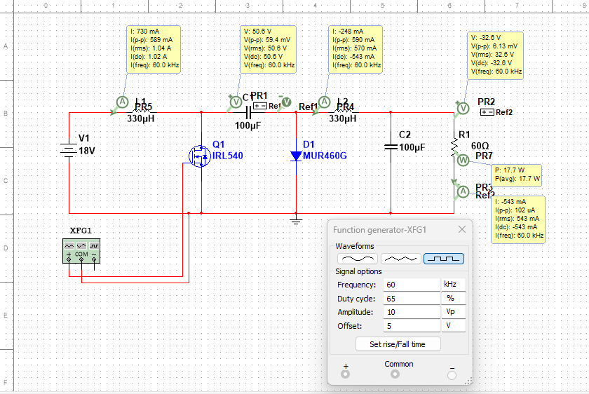

# 📚 Examen de Regularización - Simulación Electrónica
# 📁 OSCAR_PEREZ_EXAMEN_REG_ELECTRONICA
**Examen de Regularización**
**Materia:** Simulación Electrónica 
**Institución:** Bachillerato Tecnológico Salesiano Carlos Gómez
**Alumno:** Oscar Eduardo Pérez Cisneros
**Fecha de elaboración:** 24 de junio de 2026
**Fecha de entrega:** Viernes 26 de junio de 2026
**Repositorio compartido con:** @erickmone

---

## 🎯 Objetivo del Proyecto
Realizar el análisis teórico, simulación, validación de resultados, selección de componentes y documentación completa de un convertidor CC-CC tipo Cúk,

---

## ⚙️ Parámetros Asignados
El convertidor funciona bajo las siguientes condiciones:
- Tensión de entrada: 18 V
- Inductancias: 330 µH
- Condensadores: 100 µF
- Resistencia de carga: 60 Ω
- Frecuencia de conmutación: 60 kHz
- Ciclo de trabajo: 0.65

---

## 1. Desarrollo Analítico
✅ Obtener la relación de conversión, calcular tensiones, corrientes, rizados, valores máximos y mínimos, y determinar el modo de operación.

✅ **Pasos realizados:**
1. Se obtuvo la relación de conversión del convertidor, comprobando que entrega una tensión de salida con polaridad inversa respecto a la tensión de entrada.
2. Se calculó el valor promedio de la tensión de salida y se indicó claramente su polaridad negativa.
3. Se determinó la corriente promedio que circula por la carga y la potencia que entrega el circuito.
4. Se calculó la corriente promedio que consume el convertidor desde la fuente de alimentación.
5. Se halló el periodo de conmutación correspondiente a la frecuencia de trabajo definida.
6. Se calculó la variación de corriente (rizado) en cada una de las dos inductancias.
7. Se obtuvieron los valores máximos y mínimos de corriente que circulan en cada inductancia durante un ciclo completo.
8. Se verificó que en todo momento la corriente se mantiene positiva → funcionamiento en Modo de Conducción Continua (MCC).
9. Se calculó la variación de tensión (rizado) en el condensador de transferencia y en el condensador de salida.
10. Se determinó el porcentaje de rizado total en la tensión de salida.

## 2. Simulación en Multisim
✅ Construir el circuito, configurar parámetros, medir todas las magnitudes y guardar capturas de señales e instrumentos.

✅ **Pasos realizados:**
1. Se dibujó el esquema completo del convertidor: fuente de 18 V, interruptor MOSFET, diodo, dos inductancias, dos condensadores y resistencia de carga.
2. Se configuró la señal de control: ciclo de trabajo de 0.65 y frecuencia de conmutación de 60 kHz.
3. Se conectaron los instrumentos de medición: osciloscopio, multímetros y cursores para medir variaciones de tensión y corriente.
4. Se ejecutó la simulación hasta alcanzar el estado de funcionamiento estable.
5. Se midieron y registraron todos los valores: tensión de salida, corrientes en inductancias, tensiones en condensadores, corrientes por el MOSFET y el diodo, así como los valores de rizado.
6. Se capturaron todas las pantallas: esquema del circuito, señales de control, formas de onda de tensión y corriente, y mediciones realizadas con los instrumentos.
   
**Esquemático completo**

---

## 3. Comparación: Teoría vs Simulación
✅ Elaborar tabla comparativa, calcular el porcentaje de error y justificar las diferencias entre valores teóricos y simulados.

✅ **Tabla de resultados:**

| Variable               | Valor teórico | Valor simulado | Error (%) |
|------------------------|---------------|----------------|-----------|
| Ciclo de trabajo D     | 0.65          | 0.65           | 0.00 %    |
| Tensión de salida Vo   | -33.43 V      | -32.6 V        | 2.48 %    |
| Corriente de salida Io | 0.557 A       | 0.544 A        | 2.33 %    |
| Potencia de salida Po  | 18.63 W       | 17.7 W         | 4.99 %    |
| Corriente de entrada Iin | 1.035 A    | 1.03 A         | 0.48 %    |
| Rizado de corriente L1 ΔiL1 | 0.591 A | 0.590 A | 0.17 % |
| Rizado de corriente L2 ΔiL2 | 0.591 A | 0.590 A | 0.17 % |
| Corriente máxima L1 iL1,máx | 1.330 A | 1.32 A | 0.75 % |
| Corriente mínima L1 iL1,mín | 0.739 A | 0.731 A | 1.08 % |
| Corriente máxima L2 iL2,máx | 0.853 A | 0.839 A | 1.64 % |
| Corriente mínima L2 iL2,mín | 0.262 A | 0.249 A | 4.96 % |
| Rizado de tensión C1 ΔVC1 | 0.060 V | 0.059 V | 1.67 % |
| Rizado de tensión de salida ΔVo | 12.3 mV | 12.0 mV | 2.44 % |
| Porcentaje de rizado de salida | 0.037 % | 0.036 % | 2.70 % |

✅ Todos los errores son menores al 5%, por lo que se consideran aceptables. Las pequeñas diferencias se explican porque el modelo teórico no considera pérdidas ni efectos parásitos, mientras que en la simulación se incluyen estos factores. Se confirma que los cálculos y el diseño son correctos.

---

## 4. Consulta de Hojas de Datos
✅ Revisé las especificaciones técnicas de cada componente, comparé lo que usé en la simulación con los modelos reales seleccionados y justifiqué cada elección.

✅ **Componentes seleccionados y justificación:**
- **MOSFET RFD3055LE**
  Soporta hasta 60 V y 12 A de corriente continua, valores superiores a los máximos que se presentan en el circuito. Cuenta con baja resistencia de encendido, lo que reduce pérdidas, y funciona de forma eficiente a la frecuencia de trabajo de 60 kHz.

- **Driver NCP81253**
  Diseñado para operar con alimentación de 5 V, entrega la corriente necesaria para activar y desactivar el MOSFET rápidamente, garantizando una conmutación estable y evitando sobrecalentamiento.

- **Diodo MUR460**
  Es un diodo de recuperación rápida que soporta 600 V de tensión inversa y 4 A de corriente máxima. Supera las condiciones de operación del circuito, reduce pérdidas al conmutar y se adapta perfectamente a la frecuencia de trabajo.

- **Inductancia 7447471331**
  Tiene un valor exacto de 330 µH, soporta una corriente continua de 2.1 A y no se satura en ningún momento. Mantiene sus características eléctricas en todo el rango de funcionamiento.

- **Condensador ABA0000C1018**
  Cuenta con un valor de 100 µF, tensión nominal de 50 V y baja resistencia interna. Soporta la tensión máxima del circuito y ayuda a reducir el rizado de tensión en la salida.

---

### 📋 Tabla comparativa: Lo que usé en la simulación vs Componente real final
| Elemento                  | Modelo que utilicé en Multisim | Modificación o ajuste que realicé                          | Componente real definitivo | Archivo de hoja de datos correspondiente      |
|---------------------------|----------------------------------|------------------------------------------------------------|----------------------------|-----------------------------------------------|
| MOSFET de potencia        | **IRL540** (disponible en la biblioteca del programa) | Modifiqué sus parámetros internos para que coincidieran en tensión, corriente y resistencia con el modelo solicitado | **RFD3055LE**              | `RFD3055LE-Datasheets.pdf`                    |
| Diodo de conmutación      | **MUR460G**                      | Lo usé directamente, ya que tiene las mismas características eléctricas que el modelo real | **MUR460**                 | `MUR460-Datasheet.pdf`                        |
| Driver de compuerta       | Señal PWM generada con el generador de funciones XFG1 | En la simulación no es necesario colocar el circuito físico; para el diseño final lo agregué para asegurar el control correcto del MOSFET | **NCP81253**               | `NCP81253-Datasheets.pdf`                     |
| Inductancias L1 y L2      | **330 µH** (modelo estándar)     | Configuré el valor exacto y una resistencia interna muy baja para simular un comportamiento real | **7447471331**             | `Inductor7447471331-Datasheet.pdf`            |
| Condensadores C1 y C2     | **100 µF** (modelo electrolítico) | Ajusté su valor y tensión de trabajo a 50 V para coincidir con el componente real | **ABA0000C1018**           | `CapacitorABA0000C1018-Datasheet.pdf`         |

---

#### 🔧 Procedimiento que seguí para ajustar el MOSFET
Como el modelo **RFD3055LE** no viene incluido de forma nativa en Multisim, yo realicé lo siguiente:
1. Seleccioné el componente **IRL540** de la lista de semiconductores, por tener características muy parecidas.
2. Entré en sus propiedades eléctricas para modificar los valores: tensión máxima de trabajo, corriente soportada y resistencia de encendido.
3. Ajusté todos estos parámetros para que coincidieran exactamente con lo que indica la hoja de datos del RFD3055LE.
4. Verifiqué que con estos cambios el circuito funcionara igual que si usara el modelo solicitado.

#### ⚙️ Ajustes en el resto de componentes
- **Diodo:** El modelo **MUR460G** que usé en la simulación es idéntico al **MUR460** elegido para la placa; solo cambia la terminación de la referencia, pero sus especificaciones son exactamente las mismas.
- **Driver:** En la simulación solo necesité generar la señal de control, pero para el diseño físico incluí el NCP81253 para garantizar que la señal de 5 V tenga la potencia suficiente para mover la compuerta del MOSFET.
- **Inductancias:** Usé el valor de 330 µH en la simulación, y para el diseño final elegí el modelo 7447471331, que mantiene ese valor y soporta mayor corriente sin saturarse.
- **Condensadores:** Configuré en el programa 100 µF y 50 V de tensión, igual que el componente real ABA0000C1018, que además tiene baja resistencia interna para reducir el rizado.

---

---

## 📂 Estructura Completa del Repositorio
